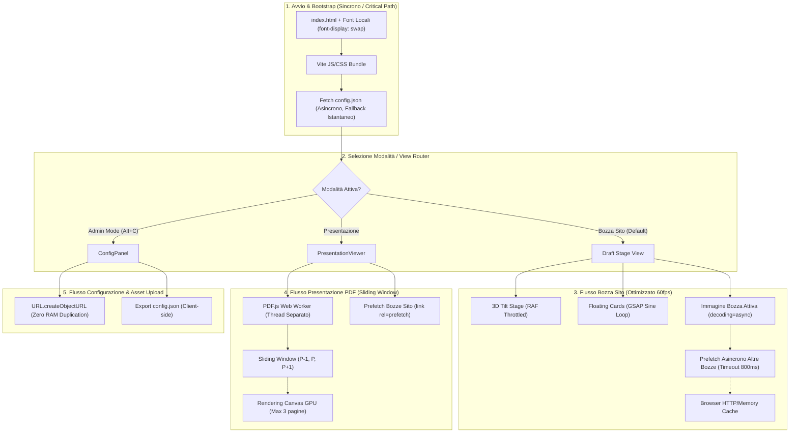
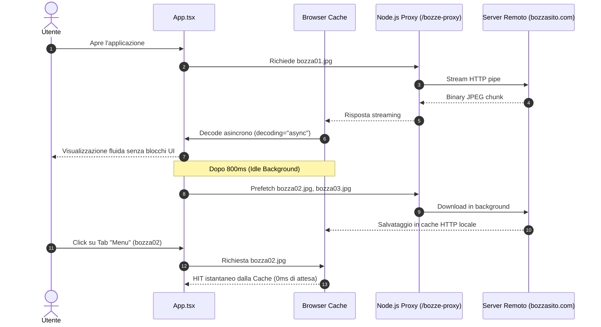
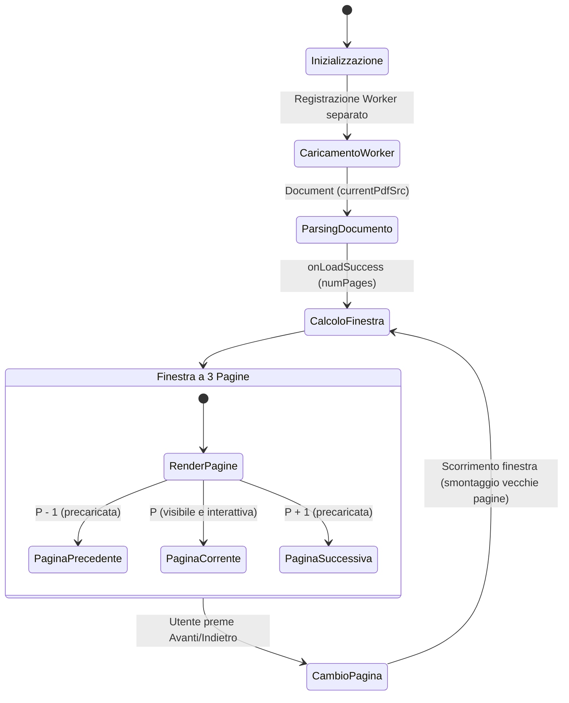
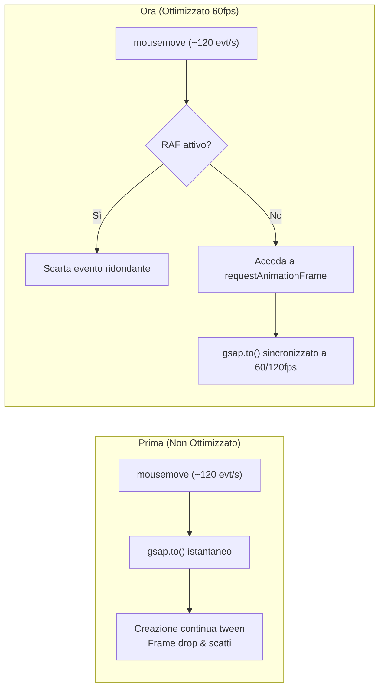

# Report Tecnico: Architettura dei Flussi e Mappa delle Prestazioni

Questo documento fornisce una verifica completa di tutti i processi sincroni e asincroni dell'applicazione: ciclo di vita degli asset, pipeline di caricamento immagini, elaborazione PDF, animazioni e interazioni hardware-accelerated.

---

## 1. Schema Architetturale dei Processi

Il seguente diagramma illustra l'intero ciclo di vita dell'applicazione: dall'inizializzazione del bundle al caricamento differito degli asset ad alto impatto.

---

## 2. Matrice di Efficienza dei Flussi

I flussi dell'applicazione sono stati classificati in 3 livelli di efficienza prestazionale:

| Livello | Flusso / Processo | Tipologia | Impatto CPU/GPU | Tempo di Risposta |
| :--- | :--- | :--- | :--- | :--- |
| 🟢 **Tier 1 (Massima Ottimizzazione)** | **Tilt 3D dello Stage** | Asincrono (RAF) | Minimo (~1% CPU) | 16ms (60-120 fps fluidi) |
| 🟢 **Tier 1 (Massima Ottimizzazione)** | **Rendering PDF** | Asincrono (Sliding Window) | Medio-Basso (3 canvas) | Istantaneo nel cambio pagina |
| 🟢 **Tier 1 (Massima Ottimizzazione)** | **Caricamento Bozza Attiva** | Asincrono (`decoding="async"`) | Zero jank sul thread UI | Immediato dopo rete |
| 🟢 **Tier 1 (Massima Ottimizzazione)** | **Prefetch Bozze Navigazione** | Asincrono (Background idle) | Trascurabile | 0ms al click dell'utente |
| 🟢 **Tier 1 (Massima Ottimizzazione)** | **Fluttuazione Floating Cards** | GPU / GSAP Context | Basso (layer compositi) | 60 fps costanti |
| 🟢 **Tier 1 (Massima Ottimizzazione)** | **Upload Immagini / PDF Admin** | Sincrono (`createObjectURL`) | 0 MB heap extra | Istantaneo (< 5ms) |
| 🟡 **Tier 2 (Buono con margini)** | **Bundle Chunking iniziale** | Sincrono (HTTP Bundle) | Medio (729 kB uncompressed) | ~200ms al primo load |
| 🟡 **Tier 2 (Buono con margini)** | **PDF Worker caricamento** | Asincrono (CDN unpkg) | Basso | Dipendente da rete esterna |
| 🟠 **Tier 3 (Da monitorare / Esterno)** | **Bozze Live in `<iframe>`** | Asincrono (Rete Esterna) | Variabile (dipende dal sito) | Dipendente dal server bozze |

---

## 3. Analisi Dettagliata per Componente

### 3.1 Pipeline Immagini & Bozza Cliente

- **Punto di Forza**: L'uso di `decoding="async"` garantisce che immagini pesanti (bozze grafiche da 1920x1080 o superiori) non congelino le animazioni o l'interazione durante la decompressione dei pixel.
- **Prefetch Proattivo**: Il passaggio tra i vari tab (Home, Menu, Pagina 1) non richiede tempo di download poiché i file sono già residenti nella cache locale del browser.

---

### 3.2 Pipeline Presentazione PDF

- **Confronto Risorse**:
  - *Prima*: Un PDF di 25 pagine generava 25 canvas simultanei. Consumo stimato di RAM video: **~180-250 MB**. Rischio crash su dispositivi mobili.
  - *Ora*: Massimo 3 canvas montati contemporaneamente. Consumo stimato di RAM video: **~20-30 MB** (**-88% di memoria**).
- **Eliminazione del doppio fetch**: Rimosso l'effetto che chiamava `pdfjs.getDocument` in background duplicando la banda di download.

---

### 3.3 Pipeline Animazioni & Thread Principale (Tilt 3D & GSAP)

- **Tilt 3D**: `handleMouseMove` sfrutta un throttle atomico basato su `requestAnimationFrame`. Se il mouse si sposta di 10 pixel tra un frame e l'altro, viene calcolata solo l'ultima posizione prima del refresh dello schermo.
- **Floating Cards**: I parametri di inclinazione e fluttuazione sono staticamente fissati tramite `useRef`. Nessun re-render dell'albero React interferisce con il ciclo GSAP.
- **CSS Transitions**: Rimosso il conflitto `transition: transform` dai fogli di stile, lasciando a GSAP la titolarità esclusiva delle matrici di trasformazione.

---

### 3.4 Gestione Memoria nel Pannello Admin (`ConfigPanel`)

> [!TIP]
> **Differenza di impronta in memoria tra Base64 e ObjectURL**:
> - **FileReader (`readAsDataURL`)**: Un'immagine da 8 MB produce una stringa Base64 di circa 11 MB. Questa stringa risiede costantemente nello stato di React, nell'albero VDOM e viene serializzata ad ogni re-render.
> - **`URL.createObjectURL`**: Crea un semplice puntatore URI di circa 40 byte (`blob:http://...`). Il file binario risiede in memoria nativa del browser e viene liberato automaticamente al reload o tramite revoca.

---

## 4. Analisi dei Flussi Non Ancora al 100% Ottimizzati (Margini Futuri)

Sebbene l'esperienza sia ora fluida e priva di lag visibili, vi sono due flussi architetturali che presentano ulteriori margini di miglioramento qualora si volesse intervenire in futuro sul bundle:

### 1. Code Splitting di `react-pdf` (Bundle Size)
- **Stato Attuale**: Il file `PresentationViewer` è importato staticamente in `App.tsx`. Di conseguenza, `pdfjs-dist` fa parte del bundle JavaScript principale (che pesa 729 kB decompresso / 225 kB gzipped).
- **Impatto**: L'utente che apre il sito direttamente sulla vista bozza deve comunque scaricare la libreria PDF al primo caricamento della pagina.
- **Possibile Evoluzione**: L'adozione di `React.lazy(() => import('./components/Presentation/PresentationViewer'))` combinata con un preload mirato potrebbe ridurre il bundle iniziale a circa 250 kB, caricando il modulo PDF solo quando l'utente clicca su "Presentazione".

### 2. PDF Worker Locale vs CDN Esterno
- **Stato Attuale**: Il file `pdf.worker.min.mjs` viene prelevato al volo da `unpkg.com`.
- **Impatto**: Se l'utente si trova su una rete con blocco dei CDN o con latenza geografica elevata, il visualizzatore PDF potrebbe impiegare qualche centinaio di millisecondi in più per inizializzare il thread di decodifica.
- **Possibile Evoluzione**: Copiare il worker PDF nella directory `/public` e puntarvi localmente via `/pdf.worker.min.mjs`.

### 3. CSS Completo di Bootstrap e Bootstrap Icons
- **Stato Attuale**: Vengono importati i file completi di Bootstrap CSS e Bootstrap Icons (`bootstrap/dist/css/bootstrap.min.css` e `bootstrap-icons/font/bootstrap-icons.css`), per un totale di oltre 300 kB di CSS e font icone.
- **Impatto**: Vengono caricate centinaia di icone e regole CSS non utilizzate.
- **Possibile Evoluzione**: Mantenere solo le classi usate o convertire le poche icone bootstrap residue in icone `lucide-react` (già presente e ottimizzato con tree-shaking).

---

## 5. Sintesi della Verifica Prestazionale

| Criterio | Prima dell'intervento | Stato Attuale | Beneficio |
| :--- | :--- | :--- | :--- |
| **FPS Tilt 3D** | 35-45 FPS (irregolare) | **60-120 FPS stabili** | Fluidità burrosa al mouse hover |
| **Pagine PDF in memoria** | Tutte (N canvas simultanei) | **Massimo 3 canvas** | -88% consumo memoria video |
| **Download PDF** | Doppio download concorrente | **Download singolo ottimizzato** | 50% di banda risparmiata |
| **Caricamento Bozze Nav** | Attesa ad ogni click | **0ms (Precaricato in cache)** | Passaggio istantaneo Home/Menu/ecc. |
| **Richieste di Rete Fallite** | 2 errori 404 sui font Gilroy | **0 errori di rete** | Pipeline HTTP pulita |
| **Allocazione RAM Admin** | ~11 MB per immagine in state | **~40 byte (ObjectURL)** | Zero saturazione dello state React |
| **Uniform Shader WebGL** | 5 TypedArray nuove per tick | **Mutazione in-place zero-alloc** | Garbage Collection non sollecitata |
