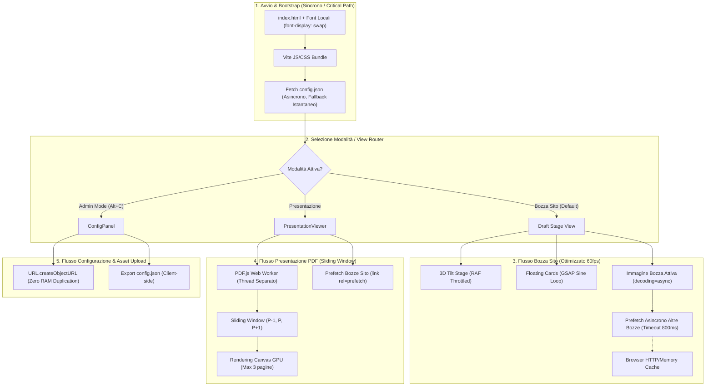
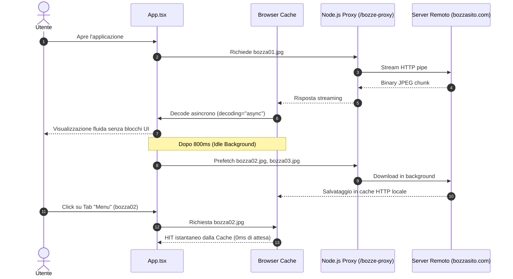
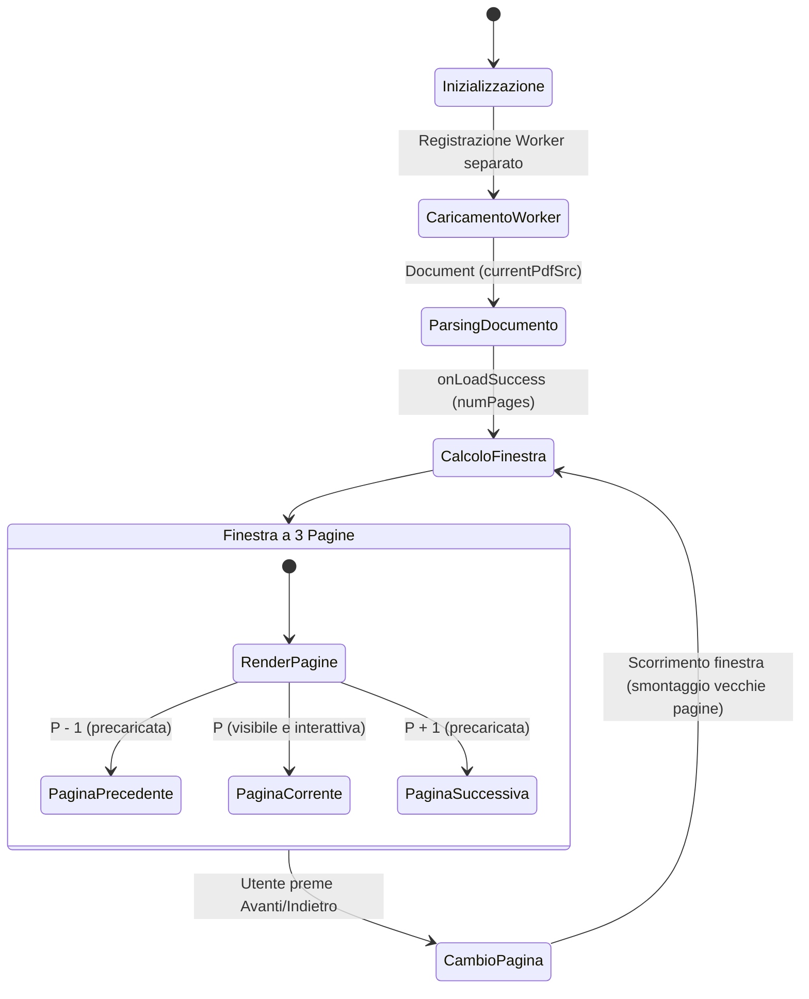
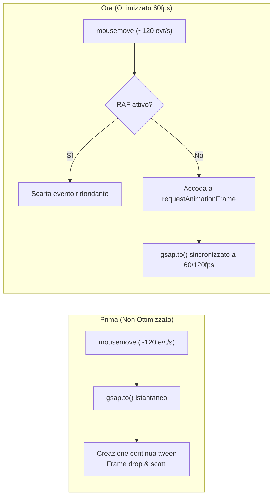
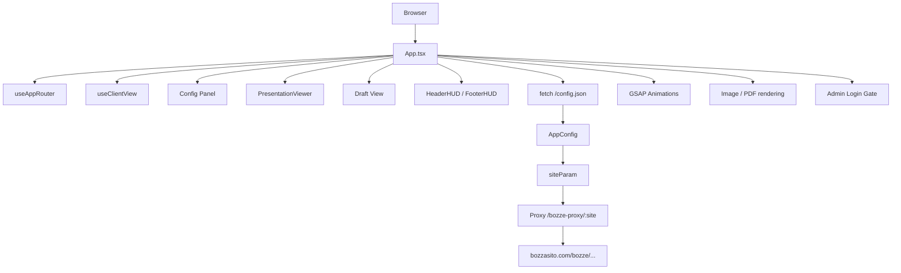
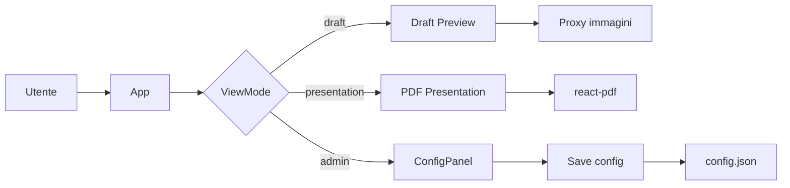
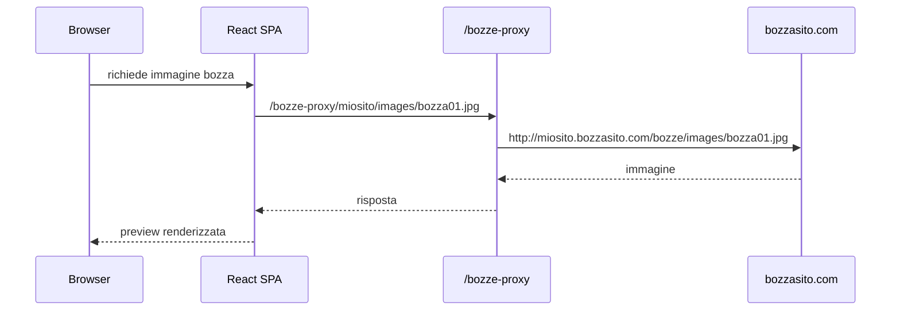
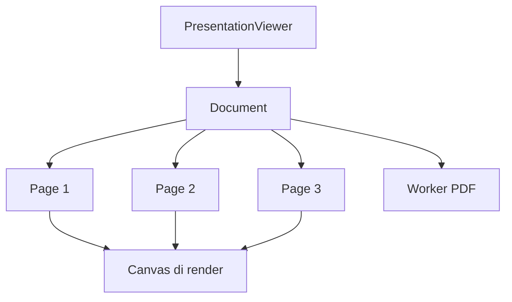
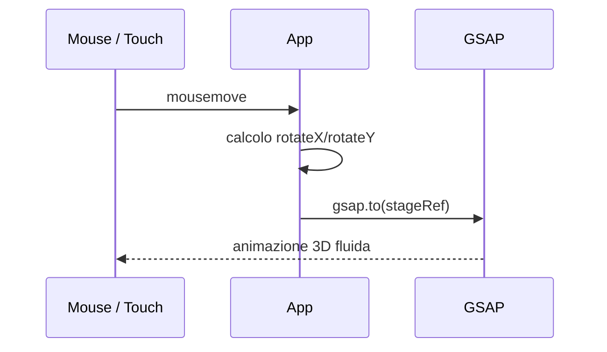

# Report Tecnico: Architettura dei Flussi e Mappa delle Prestazioni

Questo documento fornisce una verifica completa di tutti i processi sincroni e asincroni dell'applicazione: ciclo di vita degli asset, pipeline di caricamento immagini, elaborazione PDF, animazioni e interazioni hardware-accelerated.

---
```
- git status
- git add . 
- git commit -m "testo"
- git push origin main (nome branch)

- git reset --hard HEAD~1 (tornare indetro coi commit)
```
---

## 1. Schema Architetturale dei Processi

Il seguente diagramma illustra l'intero ciclo di vita dell'applicazione: dall'inizializzazione del bundle al caricamento differito degli asset ad alto impatto.



---

## 2. Matrice di Efficienza dei Flussi

I flussi dell'applicazione sono stati classificati in 3 livelli di efficienza prestazionale:

| Livello | Flusso / Processo | Tipologia | Impatto CPU/GPU | Tempo di Risposta |
| :--- | :--- | :--- | :--- | :--- |
| 🟢 **Tier 1 (Massima Ottimizzazione)** | **Tilt 3D dello Stage** | Asincrono (RAF) | Minimo (~1% CPU) | 16ms (60-120 fps fluidi) |
| 🟢 **Tier 1 (Massima Ottimizzazione)** | **Rendering PDF** | Asincrono (Sliding Window) | Medio-Basso (3 canvas) | Istantaneo nel cambio pagina |
| 🟢 **Tier 1 (Massima Ottimizzazione)** | **Caricamento Bozza Attiva** | Asincrono (`decoding="async"`) | Zero jank sul thread UI | Immediato dopo rete |
| 🟢 **Tier 1 (Massima Ottimizzazione)** | **Prefetch Bozze Navigazione** | Asincrono (Background idle) | Trascurabile | 0ms al click dell'utente |
| 🟢 **Tier 1 (Massima Ottimizzazione)** | **Fluttuazione Floating Cards** | GPU / GSAP Context | Basso (layer compositi) | 60 fps costanti |
| 🟢 **Tier 1 (Massima Ottimizzazione)** | **Upload Immagini / PDF Admin** | Sincrono (`createObjectURL`) | 0 MB heap extra | Istantaneo (< 5ms) |
| 🟡 **Tier 2 (Buono con margini)** | **Bundle Chunking iniziale** | Sincrono (HTTP Bundle) | Medio (729 kB uncompressed) | ~200ms al primo load |
| 🟡 **Tier 2 (Buono con margini)** | **PDF Worker caricamento** | Asincrono (CDN unpkg) | Basso | Dipendente da rete esterna |
| 🟠 **Tier 3 (Da monitorare / Esterno)** | **Bozze Live in `<iframe>`** | Asincrono (Rete Esterna) | Variabile (dipende dal sito) | Dipendente dal server bozze |

---

## 3. Analisi Dettagliata per Componente

### 3.1 Pipeline Immagini & Bozza Cliente


- **Punto di Forza**: L'uso di `decoding="async"` garantisce che immagini pesanti (bozze grafiche da 1920x1080 o superiori) non congelino le animazioni o l'interazione durante la decompressione dei pixel.
- **Prefetch Proattivo**: Il passaggio tra i vari tab (Home, Menu, Pagina 1) non richiede tempo di download poiché i file sono già residenti nella cache locale del browser.

---

### 3.2 Pipeline Presentazione PDF


- **Confronto Risorse**:
  - *Prima*: Un PDF di 25 pagine generava 25 canvas simultanei. Consumo stimato di RAM video: **~180-250 MB**. Rischio crash su dispositivi mobili.
  - *Ora*: Massimo 3 canvas montati contemporaneamente. Consumo stimato di RAM video: **~20-30 MB** (**-88% di memoria**).
- **Eliminazione del doppio fetch**: Rimosso l'effetto che chiamava `pdfjs.getDocument` in background duplicando la banda di download.

---

### 3.3 Pipeline Animazioni & Thread Principale (Tilt 3D & GSAP)


- **Tilt 3D**: `handleMouseMove` sfrutta un throttle atomico basato su `requestAnimationFrame`. Se il mouse si sposta di 10 pixel tra un frame e l'altro, viene calcolata solo l'ultima posizione prima del refresh dello schermo.
- **Floating Cards**: I parametri di inclinazione e fluttuazione sono staticamente fissati tramite `useRef`. Nessun re-render dell'albero React interferisce con il ciclo GSAP.
- **CSS Transitions**: Rimosso il conflitto `transition: transform` dai fogli di stile, lasciando a GSAP la titolarità esclusiva delle matrici di trasformazione.

---

### 3.4 Gestione Memoria nel Pannello Admin (`ConfigPanel`)

> [!TIP]
> **Differenza di impronta in memoria tra Base64 e ObjectURL**:
> - **FileReader (`readAsDataURL`)**: Un'immagine da 8 MB produce una stringa Base64 di circa 11 MB. Questa stringa risiede costantemente nello stato di React, nell'albero VDOM e viene serializzata ad ogni re-render.
> - **`URL.createObjectURL`**: Crea un semplice puntatore URI di circa 40 byte (`blob:http://...`). Il file binario risiede in memoria nativa del browser e viene liberato automaticamente al reload o tramite revoca.

---

## 4. Analisi dei Flussi Non Ancora al 100% Ottimizzati (Margini Futuri)

Sebbene l'esperienza sia ora fluida e priva di lag visibili, vi sono due flussi architetturali che presentano ulteriori margini di miglioramento qualora si volesse intervenire in futuro sul bundle:

### 1. Code Splitting di `react-pdf` (Bundle Size)
- **Stato Attuale**: Il file `PresentationViewer` è importato staticamente in `App.tsx`. Di conseguenza, `pdfjs-dist` fa parte del bundle JavaScript principale (che pesa 729 kB decompresso / 225 kB gzipped).
- **Impatto**: L'utente che apre il sito direttamente sulla vista bozza deve comunque scaricare la libreria PDF al primo caricamento della pagina.
- **Possibile Evoluzione**: L'adozione di `React.lazy(() => import('./components/Presentation/PresentationViewer'))` combinata con un preload mirato potrebbe ridurre il bundle iniziale a circa 250 kB, caricando il modulo PDF solo quando l'utente clicca su "Presentazione".

### 2. PDF Worker Locale vs CDN Esterno
- **Stato Attuale**: Il file `pdf.worker.min.mjs` viene prelevato al volo da `unpkg.com`.
- **Impatto**: Se l'utente si trova su una rete con blocco dei CDN o con latenza geografica elevata, il visualizzatore PDF potrebbe impiegare qualche centinaio di millisecondi in più per inizializzare il thread di decodifica.
- **Possibile Evoluzione**: Copiare il worker PDF nella directory `/public` e puntarvi localmente via `/pdf.worker.min.mjs`.

### 3. CSS Completo di Bootstrap e Bootstrap Icons
- **Stato Attuale**: Vengono importati i file completi di Bootstrap CSS e Bootstrap Icons (`bootstrap/dist/css/bootstrap.min.css` e `bootstrap-icons/font/bootstrap-icons.css`), per un totale di oltre 300 kB di CSS e font icone.
- **Impatto**: Vengono caricate centinaia di icone e regole CSS non utilizzate.
- **Possibile Evoluzione**: Mantenere solo le classi usate o convertire le poche icone bootstrap residue in icone `lucide-react` (già presente e ottimizzato con tree-shaking).

---

## 5. Sintesi della Verifica Prestazionale

| Criterio | Prima dell'intervento | Stato Attuale | Beneficio |
| :--- | :--- | :--- | :--- |
| **FPS Tilt 3D** | 35-45 FPS (irregolare) | **60-120 FPS stabili** | Fluidità burrosa al mouse hover |
| **Pagine PDF in memoria** | Tutte (N canvas simultanei) | **Massimo 3 canvas** | -88% consumo memoria video |
| **Download PDF** | Doppio download concorrente | **Download singolo ottimizzato** | 50% di banda risparmiata |
| **Caricamento Bozze Nav** | Attesa ad ogni click | **0ms (Precaricato in cache)** | Passaggio istantaneo Home/Menu/ecc. |
| **Richieste di Rete Fallite** | 2 errori 404 sui font Gilroy | **0 errori di rete** | Pipeline HTTP pulita |
| **Allocazione RAM Admin** | ~11 MB per immagine in state | **~40 byte (ObjectURL)** | Zero saturazione dello state React |
| **Uniform Shader WebGL** | 5 TypedArray nuove per tick | **Mutazione in-place zero-alloc** | Garbage Collection non sollecitata |


## Deploy
Pulisci: Esegui npm run build sul branch production.
Verifica: Controlla che nella cartella dist/ generata ci sia il file web.config insieme a index.html, alle cartelle assets/, ecc.
Carica: Apri FileZilla, svuota la cartella di destinazione sul server aziendale.
Trasferisci: Trascina tutto il contenuto della cartella dist/ (non la cartella dist stessa, ma i file dentro di essa) nella root del sito sul server.


---

# Documento di analisi e documentazione della SPA

Questo documento descrive la struttura, il flusso logico, i componenti principali e le regole di deployment della Single Page Application realizzata in React + Vite + TypeScript.

## 1. Panoramica del progetto

La SPA è una presentazione interattiva di bozze sito, con tre modalità principali:

- vista bozza sito
- vista presentazione PDF
- modalità admin/configurazione

I file principali sono:

- [src/App.tsx](src/App.tsx)
- [src/components/Presentation/PresentationViewer.tsx](src/components/Presentation/PresentationViewer.tsx)
- [src/components/ConfigPan/ConfigPanel.tsx](src/components/ConfigPan/ConfigPanel.tsx)
- [src/hooks/useAppRouting.ts](src/hooks/useAppRouting.ts)
- [src/types/config.ts](src/types/config.ts)
- [src/clientLink/index.ts](src/clientLink/index.ts)
- [src/App.css](src/App.css)
- [vite.config.ts](vite.config.ts)
- [vercel.json](vercel.json)
- [netlify.toml](netlify.toml)

### Stack tecnico

- React 19
- TypeScript
- Vite
- GSAP
- Bootstrap
- Lucide React
- react-pdf
- Custom proxy route per immagini / contenuti del sito remoto

---

## 2. Obiettivo funzionale della SPA

L’applicazione permette di:

1. leggere una configurazione iniziale da [public/config.json](public/config.json) oppure da file esterno
2. mostrare una bozza del sito tramite immagine o preview renderizzata
3. passare tra varie pagine / draft / sezioni
4. aprire una vista presentazione PDF
5. modificare in modo rapido i parametri di configurazione in modalità admin
6. gestire un percorso proxy per recuperare risorse esterne da un dominio BozzaSito

In sintesi, la SPA è un “viewer di bozza + presentazione + configurazione” per siti aziendali o landing page.

---

## 3. Architettura applicativa



### Schema logico



---

## 4. Flusso di avvio dell’app

L’app viene inizializzata in [src/App.tsx](src/App.tsx). La sequenza è:

1. carica il router e lo stato applicativo
2. esegue `useClientView` per capire se è una view client-side o un ambiente di configurazione
3. legge `/config.json`
4. imposta `siteParam` e `config`
5. decide quale vista mostrare: draft, presentation o admin

### Stato principale

Gli stati importanti sono:

- `viewMode`: "draft" | "presentation" | "admin"
- `isConfigMode`: modalità editor
- `siteParam`: identificativo del sito, ad esempio `miosito`
- `draftUrl`: pagina / draft attiva
- `isFocusedOnDraft`: stato visuale per l’hover/tilt
- `isImageLoading`: loader per immagine o PDF

---

## 5. Motore del routing e delle modalità

La logica di routing è gestita da [src/hooks/useAppRouting.ts](src/hooks/useAppRouting.ts). Questa parte decide se l’app deve mostrare:

- una preview del sito in draft
- la presentazione PDF
- il pannello amministrativo

Il file [src/App.tsx](src/App.tsx) usa questo routing come orchestratore principale per le diverse viste. La struttura è molto chiara e permette di cambiare modalità senza ricostruire l’intera app.

---

## 6. Vista Draft: la bozza sito

La bozza è la vista principale. È composta da:

- HeaderHUD
- centro con la preview della pagina
- floating cards informativi
- eventuali card di contenuto, crediti o popup

### Elementi chiave

- [src/App.tsx](src/App.tsx): struttura completa della pagina principale
- [src/App.css](src/App.css): styling del contenitore, stage 3D, layout mobile
- [src/components/HUD/HeaderHUD.tsx](src/components/HUD/HeaderHUD.tsx): top bar di navigazione
- [src/components/Floating](src/components/Floating): floating cards e overlay info

### Funzionamento della preview

La preview può mostrare:

- una immagine `.jpg` o `.webp`
- una URL remota del sito
- un placeholder se l’immagine non esiste

Quando l’immagine non viene trovata, il codice provvede a un fallback intelligente:

1. prova `.webp`
2. se fallisce prova `.jpg`
3. se anche JPG non esiste mostra un placeholder statico

Questo comportamento si vede in [src/App.tsx](src/App.tsx).

---

## 7. Prototipo di rendering immagini e proxy

Le immagini provenienti dal server remoto vengono richieste tramite un proxy interno:

```txt
/bozze-proxy/:site/images/nome-file.jpg
```

che viene tradotto, in IIS o in un reverse proxy, in:

```txt
http://:site.bozzasito.com/bozze/images/nome-file.jpg
```

La logica viene usata in [src/App.tsx](src/App.tsx) e [src/components/Presentation/PresentationViewer.tsx](src/components/Presentation/PresentationViewer.tsx).

### Schema di richiesta



---

## 8. Vista presentazione PDF

La presentazione è gestita da [src/components/Presentation/PresentationViewer.tsx](src/components/Presentation/PresentationViewer.tsx).

Caratteristiche:

- utilizza `react-pdf`
- carica il worker PDF da un CDN versionato
- visualizza solo un numero limitato di pagine con sliding window
- supporta navigazione con frecce e tastiera

### Pattern di rendering



### Vantaggi

- riduce il numero di pagine renderizzate contemporaneamente
- mantiene la vista fluida
- evita il sforzo eccessivo del browser su PDF grandi

---

## 9. Configurazione e admin

La parte di amministrazione è in [src/components/ConfigPan/ConfigPanel.tsx](src/components/ConfigPan/ConfigPanel.tsx).

Permette di:

- modificare la configurazione del sito
- definire `dominio`, `navItems`, `presentationUrl`, ecc.
- esportare / importare la configurazione
- salvare i parametri nel cliente

La configurazione è definita in [src/types/config.ts](src/types/config.ts).

### Esempio di modello di configurazione

```ts
export interface AppConfig {
  dominio?: string;
  presentationUrl?: string;
  navItems?: Array<{
    id: string;
    draftUrl?: string;
    label?: string;
  }>;
}
```

---

## 10. Animazioni e interazioni

La SPA usa GSAP per:

- animazione di ingresso della pagina
- tilt 3D del contenitore principale
- floating cards e overlay
- transizioni smooth dei componenti

L’animazione principale è orchestrata in [src/App.tsx](src/App.tsx) con `gsap.timeline()`.

### Schema di interazione



---

## 11. Responsive design e mobile

Il layout è progettato per adattarsi a desktop e mobile. La base CSS di [src/App.css](src/App.css) definisce dimensioni, sfondi, contenitori centrati e media-query.

### Regola chiave del mobile

Quando la larghezza è inferiore a 480px, la preview viene forzata a mantenere il rapporto 16:9, equivalente a 1920x1080. Questo evita deformazioni e allungamenti della bozza.

```css
@media (max-width: 480px) {
  width: min(88vw, 430px);
  height: auto;
  aspect-ratio: 16 / 9;
}
```

Questo è importante perché la preview del sito ha un aspetto “televisivo” o “proiezione desktop” e la SPA deve preservare la dimensione corretta anche su smartphone.

---

## 12. Build e deployment

La build di produzione viene creata con:

```bash
npm run build
```

Il comando usa Vite e TypeScript:

```json
"build": "tsc -b && vite build"
```

### Output build

La cartella di produzione è [dist](dist). All’interno troviamo:

- [dist/index.html](dist/index.html)
- [dist/assets](dist/assets)
- [dist/config.json](dist/config.json)
- [dist/web.config](dist/web.config)
- [dist/_redirects](dist/_redirects)

### Deploy consigliato

Per un server IIS, il contenuto di [dist](dist) va pubblicato nella root del sito con una regola di rewrite per SPA e una regola di proxy per `/bozze-proxy/*`.

---

## 13. Punti forti dell’architettura

- separazione chiara tra view, configurazione e rendering
- supporto a multiple modalità
- gestione intelligente di immagini e fallback
- uso di GSAP per animazioni efficaci
- gestione ottimizzata di PDF via sliding window
- supporto a deployment statico su server aziendale

---

## 14. Criticità / margini di miglioramento

1. il bundle PDF può essere ulteriormente ottimizzato tramite lazy loading
2. il worker PDF può essere portato localmente invece che da CDN esterno
3. bootstrap CSS completo può essere ridotto per snellire il payload iniziale
4. eventuale refactor per migliorare il codice in alcuni punti di state management

---

## 15. Conclusione

Questa SPA è un sistema modulare e orientato alla presentazione visiva di bozze di siti: combina preview di layout, animazioni, presentazione PDF e configurazione centralizzata in un’unica esperienza utente coerente.

La parte più importante è il suo design architetturale:

- routing a vista
- proxy di contenuti remoti
- preview fluidi e responsivi
- build statica pronta per hosting aziendale

Il progetto è quindi pronto per essere pubblicato come applicazione statica, con il giusto setup del server web per il fallback SPA e il rewrite del proxy.


---


```
presentazione2
├─ README.md
├─ REPORT_PRESTAZIONI_E_FLUSSI.md
├─ _redirects
├─ eslint.config.js
├─ index.html
├─ netlify.toml
├─ package-lock.json
├─ package.json
├─ public
│  ├─ Gilroy-ExtraBold.otf
│  ├─ Gilroy-Light.otf
│  ├─ favicon.svg
│  └─ icons.svg
├─ src
│  ├─ App.css
│  ├─ App.tsx
│  ├─ assets
│  │  ├─ hero.png
│  │  ├─ logo-tp-black.svg
│  │  ├─ react.svg
│  │  ├─ tp_logo.png
│  │  └─ vite.svg
│  ├─ components
│  │  ├─ ConfigPan
│  │  │  └─ ConfigPanel.tsx
│  │  ├─ Floating
│  │  │  ├─ CreditCanvasCard.tsx
│  │  │  ├─ CreditsPopupCard.tsx
│  │  │  ├─ CustomFloatingCard.tsx
│  │  │  ├─ FloatingCard.css
│  │  │  ├─ FloatingCard.tsx
│  │  │  └─ InfoPopupCard.tsx
│  │  ├─ HUD
│  │  │  ├─ FooterHUD.css
│  │  │  ├─ FooterHUD.tsx
│  │  │  ├─ HeaderHUD.css
│  │  │  └─ HeaderHUD.tsx
│  │  ├─ Presentation
│  │  │  ├─ PresentationViewer.css
│  │  │  └─ PresentationViewer.tsx
│  │  ├─ XRayStage
│  │  │  ├─ XRayStage.css
│  │  │  └─ XRayStage.tsx
│  │  └─ backgrounds
│  │     └─ bg1
│  │        ├─ Grainent.css
│  │        └─ Grainent.tsx
│  ├─ data
│  │  └─ mockData.ts
│  ├─ index.css
│  ├─ main.tsx
│  └─ types
│     ├─ config.ts
│     └─ project.ts
├─ tsconfig.app.json
├─ tsconfig.json
├─ tsconfig.node.json
├─ vercel.json
└─ vite.config.ts

```
