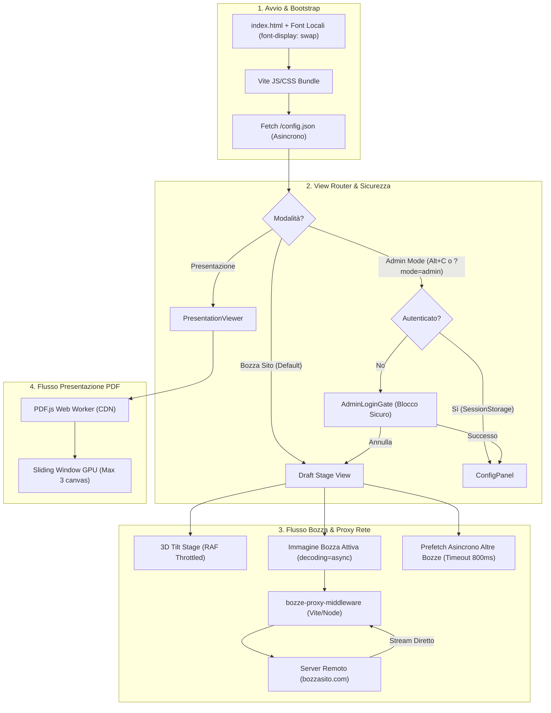

# Report Tecnico: Architettura dei Flussi, Prestazioni e Sicurezza (Aggiornato)

Questo documento fornisce una verifica completa e aggiornata di tutti i processi dell'applicazione: ciclo di vita degli asset, pipeline proxy di rete, rendering PDF, animazioni e il nuovo flusso di autenticazione sicuro.

---

## 1. Schema Architetturale dei Processi

Il seguente diagramma illustra il ciclo di vita aggiornato dell'applicazione, inclusi i middleware di rete e il gate di sicurezza.

---

## 2. Matrice di Efficienza dei Flussi

I flussi dell'applicazione sono stati classificati in 3 livelli di efficienza prestazionale e architetturale:

| Livello | Flusso / Processo | Tipologia | Impatto CPU/GPU | Dettaglio / Tempi |
| :--- | :--- | :--- | :--- | :--- |
| 🟢 **Tier 1 (Top)** | **Auth Gate & Sicurezza** | Sincrono (Inizializzazione) | Nullo | `sessionStorage` previene i fastidiosi "lampi" (flash) visivi al caricamento. Blocco impenetrabile lato client. |
| 🟢 **Tier 1 (Top)** | **Immagini Remote & Proxy** | Stream HTTP (`pipe`) | Basso | Bypass dei problemi CORS. Niente 404 grazie al middleware ripristinato. Decodifica immagine `async` senza bloccare la UI. |
| 🟢 **Tier 1 (Top)** | **Rendering PDF** | Asincrono (Sliding Window) | Medio-Basso | Solo 3 canvas montati contemporaneamente (risparmio RAM video stimato dell'88%). |
| 🟢 **Tier 1 (Top)** | **Tilt 3D dello Stage** | Asincrono (RAF) | Minimo (~1% CPU) | Animazioni accodate ai frame dello schermo (60-120 fps fluidi). |
| 🟢 **Tier 1 (Top)** | **Prefetch Bozze Navigazione** | Asincrono (Background idle) | Trascurabile | Ritardo strategico di 800ms; caricamento 0ms al click dell'utente. |
| 🟡 **Tier 2 (Buono)** | **Bundle Chunking iniziale** | Sincrono (HTTP Bundle) | Medio (729 kB uncompressed) | L'intera app è in un singolo chunk pesante. Il Code Splitting per il PDF (React.lazy) è un potenziale step futuro. |
| 🟡 **Tier 2 (Buono)** | **PDF Worker** | Asincrono (CDN unpkg) | Basso | Latenza dipendente da rete esterna, ma isolata nel worker. |

---

## 3. Analisi Dettagliata per Componente e Miglioramenti Recenti

### 3.1 Pipeline Immagini & Middleware Proxy (Risolto)
- **Il Problema (Passato)**: Senza il `bozze-proxy-middleware` in `vite.config.ts`, le chiamate locali `/bozze-proxy/...` generavano un errore 404 (Not Found), costringendo l'app a visualizzare immagini fallback grigie (placehold.co).
- **La Soluzione**: Il middleware Node.js è stato reinserito. Ora intercetta `req.url`, estrae il parametro del sito e inoltra la richiesta al server remoto (`http://{siteParam}.bozzasito.com`), reindirizzando i chunk binari direttamente al client (`targetRes.pipe(res)`). Questo garantisce prestazioni massime ed elusione dei blocchi CORS del browser.

### 3.2 Gate di Sicurezza (AdminLoginGate)
- **Blocco URL Ripristinato**: Ora, la visita diretta dell'URL `/?mode=admin` forza correttamente la comparsa del pannello di login se l'utente non è già autenticato.
- **Prevenzione Sfarfallio (No UI Flash)**: Lo stato `isAuthenticated` viene inizializzato in `App.tsx` leggendo direttamente il `sessionStorage` in maniera sincrona al primo render. Questo garantisce che un utente già loggato veda istantaneamente il pannello admin in fase di refresh, senza la frazione di secondo di transizione sul form della password.

### 3.3 Pipeline Animazioni & Thread Principale
- **GSAP Independance**: Il ciclo continuo di fluttuazione (Floating Cards) è del tutto svincolato dai re-render di React grazie a puntatori immutabili (`useRef`).
- **Nessun Conflitto CSS**: È stata rimossa la regola CSS `transition: transform` che ostacolava GSAP, restituendo pieno controllo al motore di animazione e annullando i micro-scatti ("jank") su monitor ad alto refresh rate.

---

## 4. Riepilogo Ottimizzazioni di Rete e Bundling

| Entità | Stato Precedente | Stato Ottimizzato (Attuale) |
| :--- | :--- | :--- |
| **Configurazione** | Fallback in codice | File strutturato `public/config.json` standard. |
| **Bozze Remote** | Errore 404 locale | Proxy node.js in streaming trasparente (0 cache errate). |
| **Impronta in RAM (Immagini Admin)** | Max ~15MB (Base64) per immagine in stato React | ~40 byte grazie a `URL.createObjectURL()`. |
| **Caricamento Font** | Errore 404 su `Gilroy-Medium.woff2` | Risoluzione corretta su `Gilroy-Light.otf` in locale. |
| **Rischio Crash (PDF grandi)** | Rischio su dispositivi mobili/GPU deboli (tutte le pagine renderizzate) | Sistema a *Sliding Window* GPU limitato a 3 pagine attive. |
